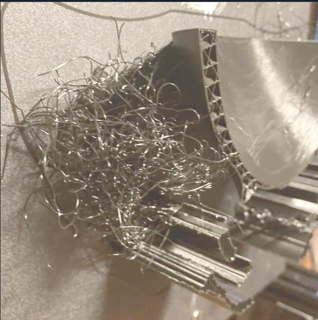
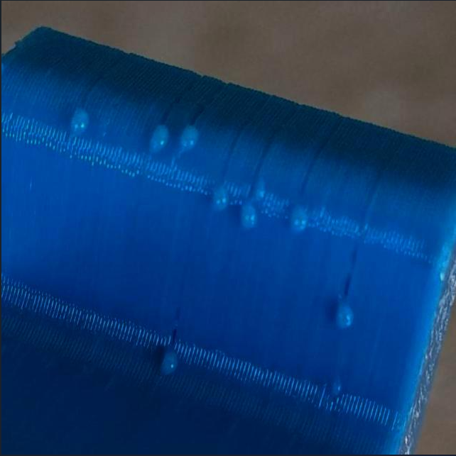
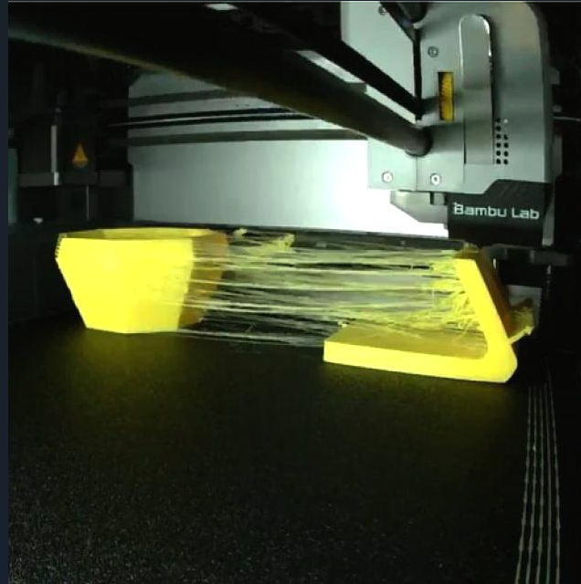
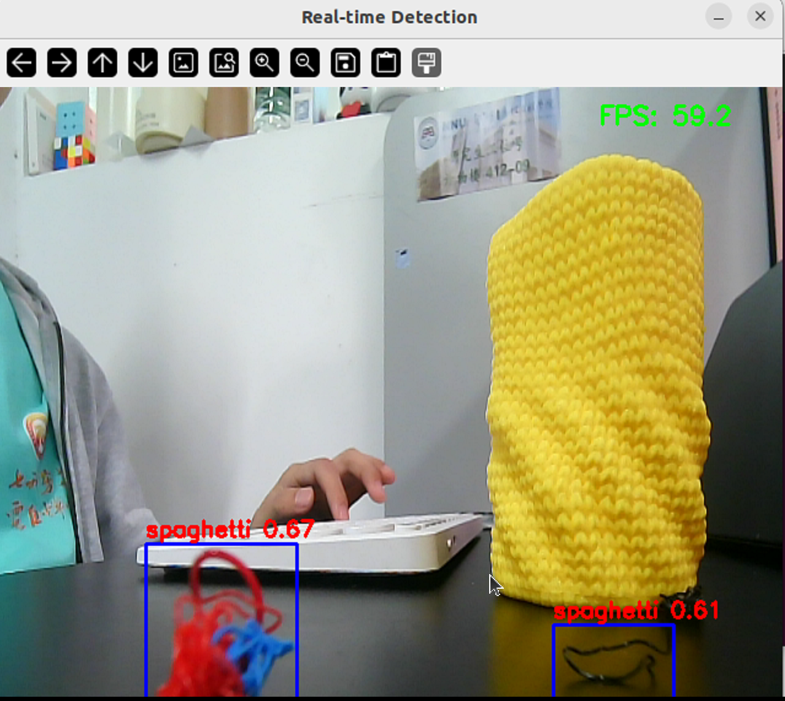
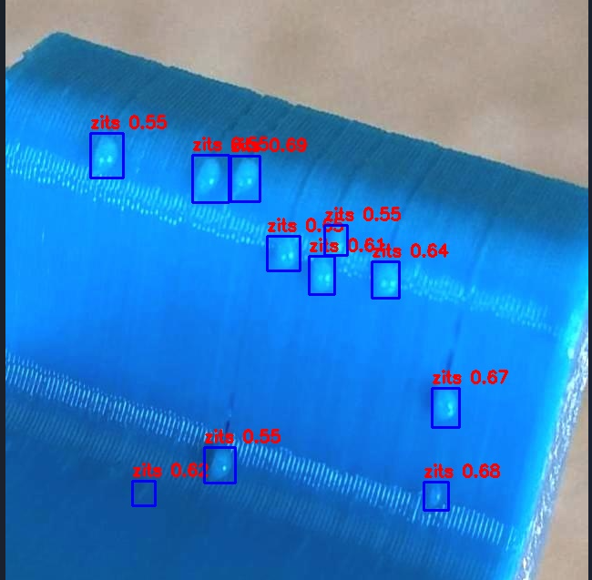

# 基于RK3588的实时3D打印缺陷检测

## 一、说明

该项目基于RK3588算力芯片，通过使用服务器将训练好的yolo_v8网络转换为onnx格式，再使用瑞芯微提供的转换代码，将其转换为rknn格式，以便于能达到使用NPU加速推理的目的。检测的缺陷类型主要有种

1. spaghetti', #大面积缺陷
2. 'zits',           #打印过程中造成的小疙瘩
3.  'stringing  #喷头的吐出的丝未成形

照片如下

> 1. spaghetti
>
> 
>
> 2. zits
>
> 
>
> 3. stringing
>
> 

## 二、构建过程

### 1. 3D打印机打构建

在使用该项目前，请先构建3D打印系统软硬件，该项目中3D打印的硬件为自行搭建，可打印尺寸为200mm* 200mm *180mm ,软件系统使用的为klipper.关于klipper的安装与构建可参考[klipper](https://www.klipper3d.org/zh/Overview.html)。安装在板卡端完成klipper后。你可以运行该3D打印系统。

### 2. yolo网络模型的训练

> 1. 请下载rockship仓库下的[yolo代码](https://github.com/airockchip/ultralytics_yolov8))
> 2. 添加数据集的路径
> 3. 运行train.py文件
> 4. 运行一下代码将.pt转换为.onnx
>
> ```bash
> yolo export model=best.pt format=rknn name=rk3588
> ```
>
> 

### 3. 转换为rknn

>转换模型格式需要使用安装rockship提供的rknn-toolkit2工具，点击该链接[rknn_model_zoo/examples/yolov8 at main · airockchip/rknn_model_zoo](https://github.com/airockchip/rknn_model_zoo/tree/main/examples/yolov8))克隆到本地。
>
>运行一下代码进行转换
>
>```bash
>cd python
>python convert.py <onnx_model> <TARGET_PLATFORM> <dtype(optional)> <output_rknn_path(optional)>
>
># such as: 
>python convert.py ../model/yolov8n.onnx rk3588
># output model will be saved as ../model/yolov8.rknn
>```

### 4. 构建检测代码

你可以运行以下代码进行视频流的缺陷检测

```bash
python tk.py
```

### 5. 运行效果



启用线程池技术，使得运行帧率可以稳定在60帧左右，远超cpu推理的运行帧率。

对照片的检测结果如下



同时该系统支持对视频与实时视频流的检测。

